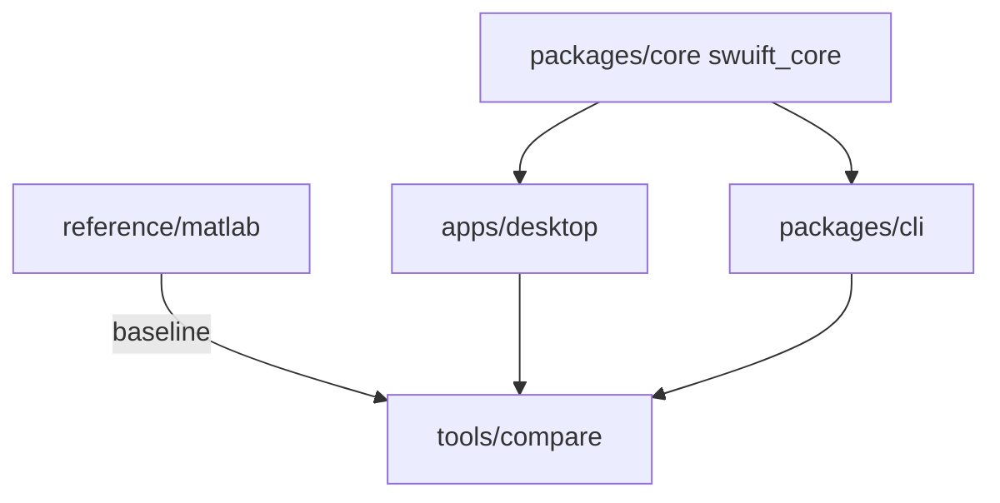

# doe-wildfire — SWUIFT Monorepo

**SWUIFT** (Simulating Wildfire-Urban Interface Fire Transmission) models wildfire spread through vegetation and the wildland–urban interface. This repository is a monorepo containing a shared physics core, a desktop GUI, a command-line tool, the original MATLAB reference, and cross-implementation comparison tooling.

| Guide | Audience |
|-------|----------|
| [MANUAL.md](MANUAL.md) | Desktop app users (GUI, job queue, all tabs and outputs) |
| [CLI_MANUAL.md](CLI_MANUAL.md) | Terminal/batch users (`swuift` command, JSON jobs) |

---

## Quick Start

```bash
cd doe-wildfire
python3 -m venv .venv && source .venv/bin/activate
python -m pip install --upgrade pip
pip install -r requirements.txt
pytest tests/unit/
```

This installs editable `packages/core` and `packages/cli`, plus shared dependencies.

**Run the desktop app:**

```bash
pip install -r apps/desktop/requirements_app.txt
cd apps/desktop && python swuift_app.py
```

**Run the CLI:**

```bash
swuift --help
```

See [MANUAL.md](MANUAL.md) and [CLI_MANUAL.md](CLI_MANUAL.md) for full usage.

---

## Repository Layout

```
doe-wildfire/
├── packages/
│   ├── core/              # swuift-core: shared physics (src/swuift_core/)
│   └── cli/               # swuift CLI package
├── apps/
│   └── desktop/           # PySide6 GUI + PyInstaller build
├── reference/
│   └── matlab/            # MATLAB reference (SWUIFT_V4.m)
├── tools/
│   └── compare/           # Cross-implementation comparison suite
├── tests/
│   ├── unit/core/         # Physics unit tests
│   ├── unit/cli/          # CLI unit tests
│   └── fixtures/          # Archived baseline outputs
├── docs/                  # Structure and lineage notes
├── data/                  # Raw MATLAB input bundles (gitignored)
├── extracted_mat/         # Per-variable inputs for Python (gitignored)
├── MANUAL.md              # Desktop app user manual
├── CLI_MANUAL.md          # CLI user manual
└── requirements.txt       # Root environment (core + cli + deps)
```

| Path | Role |
|------|------|
| `packages/core/` | Canonical fire-spread physics (`kernels`, `spread`, `hardening`, `config`) |
| `packages/cli/` | Installable `swuift` CLI — single-run and JSON batch jobs |
| `apps/desktop/` | PySide6 desktop app with tabbed config and job queue |
| `reference/matlab/` | Original MATLAB implementation — numerical baseline |
| `tools/compare/` | Run MATLAB, app, and CLI side-by-side; compare frame states; stitch videos |
| `tests/unit/` | Consolidated unit tests (22 tests) |
| `tests/fixtures/` | Archived baseline run outputs and manifests |
| `data/` | Legacy MATLAB bundles (`eaton_inputs_all.mat`, `wind_eaton.mat`, …) |
| `extracted_mat/` | Python-ready per-variable `.mat` files |

Full tree details: [docs/structure.md](docs/structure.md). Component history: [docs/lineage.md](docs/lineage.md).

---

## Architecture



All Python implementations share identical physics through `swuift-core`. The desktop app and CLI are thin wrappers that differ in workflow (GUI job queue vs terminal/batch), data-loading conveniences, and output packaging — not in fire-spread algorithms.

---

## Implementation

### Shared core (`packages/core`)

Editable package `swuift-core` with a `src/swuift_core/` layout.

| Module | Purpose |
|--------|---------|
| `kernels.py` | Numba JIT kernels with pure-Python fallback |
| `spread.py` | Brand generation/transport, full-grid radiation, ignition |
| `hardening.py` | Per-home structure hardening (MATLAB-aligned loops) |
| `config.py` | Frozen `SWUIFTConfig` dataclass with derived constants |

**Environment variables** (honored by core, app, and CLI):

| Variable | Default | Description |
|----------|---------|-------------|
| `SWUIFT_APP_KERNEL_BACKEND` | `numba` | Set to `python` for pure-Python kernels |
| `SWUIFT_APP_RADIATION_WORKERS` | `1` | Parallel radiation worker count |

### Desktop app (`apps/desktop`)

- **Entry:** `swuift_app.py` → `gui/app.py` → `MainWindow`
- **GUI:** Six configuration tabs, simulation log, job queue dock
- **Simulation:** `swuift/simulation.py` — time-step loop, plotting, frame/video output
- **Packaging:** `swuift_app.spec` (PyInstaller), `swuift_setup.iss` (Windows installer)

User guide: [MANUAL.md](MANUAL.md)

### CLI (`packages/cli`)

- **Entry:** `swuift` console script → `swuift/cli.py`
- **Modes:** Single-run (explicit flags) or `--batch` JSON jobs
- **Constraint:** `output_dir` must be outside the repository
- **Outputs:** `run_log.txt`, `run_params.json`, optional frames/video/CSV/timestep dumps

User guide: [CLI_MANUAL.md](CLI_MANUAL.md)

### MATLAB reference (`reference/matlab`)

| File | Role |
|------|------|
| `SWUIFT_V4.m` | Main simulation driver |
| `f_spread.m` | Fire-spread physics |
| `f_plots.m` | Plotting helpers |

Python implementations target numerical parity with this reference. Known differences (RNG, floating-point order, indexing) are documented in [SWUIFT_IMPLEMENTATION_DIFFERENCES_00_01_05.md](SWUIFT_IMPLEMENTATION_DIFFERENCES_00_01_05.md).

### Compare tooling (`tools/compare`)

| Script | Role |
|--------|------|
| `compare_suite.py` | Unified presets: `smoke10`, `smoke15`, `full` |
| `orchestrator.py` | Stage orchestration, frame-state normalization |
| `compare_frame_states.py` | Pairwise `int16` frame-state comparison |
| `stitch_video.py` | Tri-panel MP4 (MATLAB \| APP \| CLI) at 1080p |

The `full` preset runs fresh MATLAB (when installed), app, and CLI; records runtime comparison in JSON; and stitches a 1080p comparison video by default.

Details: [tools/compare/README.md](tools/compare/README.md)

---

## Data Setup

Large input files are not tracked in git. Place them on the target machine using either layout:

**Recommended (sibling to repo):**

```
parent/
├── data/              ← MATLAB bundles
├── extracted_mat/     ← per-variable .mat for Python
└── doe-wildfire/      ← this repository
```

**Alternative:** `data/` and `extracted_mat/` inside the `doe-wildfire/` root.

Comparison tooling auto-detects sibling paths first. Override with:

```bash
export SWUIFT_MATLAB_DATA=/path/to/data
export SWUIFT_EXTRACTED_DATA=/path/to/extracted_mat
# or
python tools/compare/compare_suite.py --preset full \
  --matlab-data /path/to/data --extracted-data /path/to/extracted_mat
```

To generate `extracted_mat/` from raw bundles, run `python data/extract_inputs_to_mat.py` (when `data/` is available).

---

## Running Simulations

| Interface | Command |
|-----------|---------|
| Desktop app | `cd apps/desktop && python swuift_app.py` |
| CLI single run | `swuift --job-name ...` (see [CLI_MANUAL.md](CLI_MANUAL.md)) |
| CLI batch | `swuift --batch packages/cli/jobs_example.json` |

---

## Validation and Comparison

```bash
# Full validation on a machine with data/ and extracted_mat/ (sibling or in-repo)
./run_full_test.sh

# Or step by step:
cd tools/compare
python orchestrator.py check-matlab
python orchestrator.py check-defaults
python compare_suite.py --preset smoke15 --stages app cli
python compare_suite.py --preset full   # runtime + 1080p stitch by default
```

If the default MATLAB baseline is missing, override with `--matlab-baseline-run-root runs/20260608_150939`.

Primary comparison artifact: normalized frame state arrays at `normalized_frame_state/state_XXXX.npy` (`int16`, categories −5 through 4).

---

## Testing

```bash
pytest tests/unit/
```

22 tests cover core physics (`tests/unit/core/`) and CLI config/data loading (`tests/unit/cli/`). Configuration in `pytest.ini`.

---

## Building and CI

### Desktop app (local)

```bash
cd apps/desktop
pip install -r requirements_app.txt
pyinstaller swuift_app.spec --noconfirm
```

- **macOS:** `build_macos.sh` → `dist/SWUIFT.app` + `.dmg`
- **Windows:** `build_windows.bat` → `dist/SWUIFT/SWUIFT.exe` + optional Inno Setup installer

### CI

[`.github/workflows/build-desktop.yml`](.github/workflows/build-desktop.yml) builds on:

- macOS arm64 (`.app` + `.dmg`)
- Windows x64 (`.exe` + installer)
- Windows ARM64 (`.exe`, Python kernel backend fallback)

---

## Documentation Index

| Document | Contents |
|----------|----------|
| [MANUAL.md](MANUAL.md) | Desktop app user manual |
| [CLI_MANUAL.md](CLI_MANUAL.md) | CLI user manual |
| [docs/structure.md](docs/structure.md) | Monorepo directory map |
| [docs/lineage.md](docs/lineage.md) | Component roles and dependencies |
| [changes.md](changes.md) | Monorepo restructure changelog |
| [SWUIFT_IMPLEMENTATION_DIFFERENCES_00_01_05.md](SWUIFT_IMPLEMENTATION_DIFFERENCES_00_01_05.md) | MATLAB vs Python parity notes |
| [tools/compare/README.md](tools/compare/README.md) | Comparison presets and orchestrator |
| [packages/core/README.md](packages/core/README.md) | Core package install and modules |

---

## License

SWUIFT is distributed under the [SWUIFT Research and Academic Use License](LICENSE) (University at Buffalo). Non-commercial research, educational, and governmental use is permitted as described in the license. Commercial use requires a separate written agreement from the University at Buffalo — contact Prof. Negar Elhami-Khorasani (`negarkho@buffalo.edu`).
