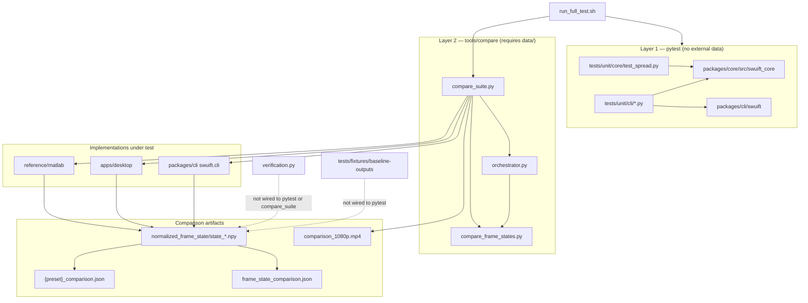
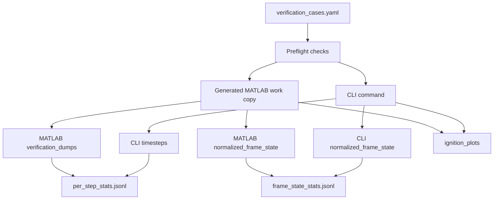

# Multi-Verification Wiring

This document describes **how comparisons are wired today** — the relationship between pytest unit tests, the cross-implementation comparison suite, and the artifacts they produce. It reflects the current codebase, not a future design.

---

## Overview

Validation is split into two layers that run sequentially in the full pipeline but are otherwise independent:

| Layer | Runner | Scope | External deps |
|-------|--------|-------|---------------|
| **Unit tests** | `pytest tests/unit/` | Small synthetic grids; config, loaders, physics kernels | None (no `data/` or MATLAB) |
| **Integration comparison** | `tools/compare/compare_suite.py` | End-to-end runs of MATLAB / app / CLI; frame-state parity | `data/`, `extracted_mat/`, optional MATLAB |

The top-level entry point that runs both layers is `run_full_test.sh`.

```
run_full_test.sh
├── verify data paths          (tools/compare/paths.py)
├── pytest tests/unit/         (22 unit tests)
└── compare_suite.py --preset full --stitch-1080p
    ├── run stages (matlab / app / cli)
    ├── normalize frame states
    ├── _compare_to_matlab()   → {preset}_comparison.json
    ├── write_frame_state_comparison() → frame_state_comparison.json  (full only)
    └── stitch_panel_video()   → comparison_1080p.mp4  (full only)
```

---

## Layer 1: Pytest unit tests

### Configuration

`pytest.ini` sets:

- `testpaths = tests/unit`
- `pythonpath = packages/cli packages/core/src apps/desktop`

This makes `swuift`, `swuift_core`, and desktop imports available without installing editable packages first (though `run_full_test.sh` installs from `requirements.txt` anyway).

### Test inventory (22 tests)

| File | What it validates | Relation to cross-impl comparison |
|------|-------------------|-----------------------------------|
| `tests/unit/core/test_spread.py` | `radiation_ig`, `radiation_kernel`, `apply_hardening` on 5×5 / 10×10 grids | Exercises the shared physics core used by app and CLI; does **not** compare against MATLAB |
| `tests/unit/cli/test_spread.py` | Same physics tests via CLI package imports | Confirms CLI re-exports core behavior; duplicate of core tests |
| `tests/unit/cli/test_config.py` | Derived constants (`fstep`, `lstep`, `limrad`, …), `maxstep == 241` for default time window | Aligns with comparison defaults in `orchestrator.DEFAULTS` |
| `tests/unit/cli/test_data_loader_mixed_inputs.py` | Mixed `.mat`/`.csv` loading, dimension mismatch rejection | Covers input paths used by comparison runs (`extracted_mat/`) |

### What unit tests do **not** cover

- No pytest module imports or calls `tools/compare/*`.
- No pytest uses `tests/fixtures/baseline-outputs/` (archived CLI CSVs; gitignored large artifacts).
- No pytest uses `packages/cli/swuift/verification.py` (CSV timestep comparison library).
- No automated assertion that app/CLI/MATLAB outputs match.

Unit tests are a **precondition gate**: they must pass before the comparison suite runs in `run_full_test.sh`, but they do not perform cross-implementation parity checks themselves.

---

## Layer 2: Integration comparison suite

All comparison tooling lives under `tools/compare/`. Shared path resolution is in `paths.py`.

### Data prerequisites

Comparison runs require local input bundles (not in git):

```
parent/
├── data/              ← MATLAB bundles (default_values.mat, wind_eaton.mat, …)
├── extracted_mat/     ← per-variable .mat files for Python
└── doe-wildfire/      ← this repo
```

Resolution order: env vars (`SWUIFT_MATLAB_DATA`, `SWUIFT_EXTRACTED_DATA`) → CLI flags (`--matlab-data`, `--extracted-data`) → sibling `../data` and `../extracted_mat` → in-repo `./data` and `./extracted_mat`.

`verify_data_paths()` is called by `compare_suite.py` and `run_full_test.sh` before any stage runs.

### Primary harness: `compare_suite.py`

Presets define step count, default stages, and smoke vs full behavior:

| Preset | Steps | Default stages | MATLAB source | Outputs |
|--------|-------|----------------|---------------|---------|
| `smoke10` | 10 | `app` (+ baseline) | Copy from `runs/20260602_162114` | `runs/smoke_10/smoke10_comparison.json` |
| `full` | 241 (full window) | `matlab_baseline`, `app`, `cli` | Fresh MATLAB run if installed, else baseline | `runs/full_{timestamp}/full_comparison.json`, `frame_state_comparison.json`, `comparison_1080p.mp4` |

Valid presets are `smoke10` and `full`.

#### Stage execution flow (`run_preset`)

```
matlab_baseline in stages?
├── smoke preset  → _copy_matlab_baseline() from DEFAULT_MATLAB_BASELINE_RUN
└── full preset
    ├── MATLAB installed → prepare_matlab_stage() + normalize_stage_outputs("matlab")
    └── else → ensure_matlab_baseline() (symlink saved run) or fallback fresh MATLAB

app in stages?  → generated run_app_{smoke|full}.py → swuift.simulation.run_simulation()
cli in stages?  → python -m swuift.cli … --output-dir {run_root}/cli/

Normalize outputs:
  app → normalized_frame_state/  (from outputs/frame_state/ or timesteps/)
  cli → normalized_frame_state/  (from latest cli_default_*/timesteps/)

Compare:
  _compare_to_matlab(matlab_dir, {app, cli}) → summary JSON

full preset only:
  write_frame_state_comparison() → compare_frame_states.py (all pairwise)
  stitch_panel_video() → comparison_1080p.mp4
```

#### Pass/fail semantics

- `compare_suite.py` exits **0** when every candidate's `matches_all_common_steps` is true.
- Exits **1** if any app or CLI step differs from MATLAB on comparable cells.
- Subprocess stage failures raise `CalledProcessError` (non-zero exit).

### Comparison target: normalized frame state

Both comparison paths operate on the same artifact:

- Files: `normalized_frame_state/state_XXXX.npy`
- Dtype: `int16`
- Categories: `[-5, -4, -2, -1, 0, 1, 2, 3, 4]` (water, vegetation burned/ignited, …)

States are built from per-timestep `fire.csv` + `ignition.csv` (and landcover/water masks) via `_build_frame_state()` in `orchestrator.py`, matching the classified matrix used for PNG rendering.

#### Two comparison implementations (both used today)

| Function | Location | Comparison style | When invoked |
|----------|----------|------------------|--------------|
| `_compare_to_matlab()` | `compare_suite.py` | Each candidate vs MATLAB only; uses fixed `FRAME_STATE_CATEGORIES` | Every preset run; written to `{preset}_comparison.json` |
| `compare_pair()` | `compare_frame_states.py` | All available pairs among matlab/app/cli; intersects category sets from manifests | Full preset via `write_frame_state_comparison()`; orchestrator `run` command; standalone CLI |

The suite comparison is MATLAB-centric and drives exit codes. The frame-state script produces richer pairwise JSON (`frame_state_comparison.json`) but is only auto-invoked for the `full` preset (and `orchestrator.py run`).

### Secondary harness: `orchestrator.py`

Lower-level runner used for ad-hoc workflows and pre-flight checks:

| Command | Purpose |
|---------|---------|
| `check-matlab` | Verify MATLAB executable responds |
| `check-defaults` | Compare hyperparameter defaults across MATLAB / app / CLI (`DEFAULTS` vs `default_values.mat` vs `build_config`) |
| `run --stages …` | Run selected stages, normalize, then call `compare_frame_states.py` |
| `render-state-video` | Render PNG/MP4/GIF from normalized states |

`orchestrator.py run` gates on `check_defaults()` unless `--allow-default-diffs` is passed. **`compare_suite.py` does not call `check_defaults()`** — only the orchestrator `run` subcommand does.

### Full validation script

`run_full_test.sh` (repo root):

1. Creates/activates `.venv`, installs `requirements.txt`
2. Verifies data paths via `paths.verify_data_paths()`
3. Runs `pytest tests/unit/ -q`
4. Runs `compare_suite.py` with default args `--preset full --stitch-1080p` (overridable by passing args through)

Any failure in steps 3 or 4 aborts the script (`set -euo pipefail`).

---

## Wiring diagram: current test → comparison path



---

## Artifacts and where to find results

After a comparison run under `tools/compare/runs/`:

| File | Contents |
|------|----------|
| `{preset}_comparison.json` | Per-candidate MATLAB parity (`matches_all_common_steps`, per-step diff counts), commands, data roots, runtime metrics (full/smoke with fresh runs) |
| `frame_state_comparison.json` | Pairwise matlab↔app, matlab↔cli, app↔cli (full preset / orchestrator run) |
| `comparison_1080p.mp4` | Side-by-side MATLAB \| APP \| CLI panels (full preset with stitching enabled) |
| `matlab/normalized_frame_state/manifest.json` | Stage metadata, category list, step count |

---

## Recommended commands (current wiring)

```bash
# Fast local check — no data, no MATLAB
pytest tests/unit/

# Smoke parity — needs data/ + extracted_mat/, uses saved MATLAB baseline
cd tools/compare
python3 compare_suite.py --preset smoke10          # app only, 10 steps

# Full validation — unit tests + 241-step comparison + video
./run_full_test.sh

# Pre-flight before a manual orchestrator run
python3 orchestrator.py check-matlab
python3 orchestrator.py check-defaults

# Re-compare an existing run directory
python3 compare_frame_states.py runs/smoke_10 --matlab-run-root runs/20260602_162114
```

---

## Gaps and non-wired components

These exist in the repo but are **not** connected to the automated test/comparison pipeline today:

| Component | Status |
|-----------|--------|
| `packages/cli/swuift/verification.py` | Library for per-timestep CSV comparison (`fire`, `ignition`, `radtotal`, …); no caller in pytest or `compare_suite` |
| `tests/fixtures/baseline-outputs/` | Archived CLI run CSVs; referenced in docs, not loaded by any test |
| `tools/compare/COMPARISON_PLAN.md` | Planned extensions (fire_prog, zvector, aggregate plots); not implemented in automated checks |
| Pytest coverage of `tools/compare/` | No unit tests for normalization, comparison logic, or preset orchestration |
| CI configuration | No in-repo workflow found that runs `compare_suite` or `run_full_test.sh` |

---

## Summary

**Today, comparisons are wired as follows:**

1. **Pytest** validates isolated physics, config, and data-loading behavior on synthetic inputs. It is a fast gate with no cross-implementation assertions.
2. **`compare_suite.py`** is the canonical integration harness: it runs app/CLI (and optionally MATLAB), normalizes outputs to `int16` frame states, compares each candidate against a MATLAB baseline, and fails the process on divergence.
3. **`run_full_test.sh`** chains pytest → full comparison, making unit tests a mandatory prerequisite for the 241-step parity run.
4. **`compare_frame_states.py`** adds three-way pairwise analysis on full runs; **`orchestrator.py`** provides defaults checking and a flexible multi-stage runner.
5. Several comparison utilities (`verification.py`, fixture baselines, planned numeric checks in `COMPARISON_PLAN.md`) remain **outside** the automated wiring.

---

## Multi-Fire CLI-vs-MATLAB Verification Wiring

The multi-fire verification path is separate from the existing app/CLI/MATLAB comparison suite. It is designed for checking CLI against MATLAB across many fire input packages, with detailed per-step statistics and controlled output size.

### Entry points

| File | Role |
|------|------|
| `tools/compare/verify_cli_matlab.py` | Runs preflight checks, generated MATLAB wrapper, CLI, artifact collection, and per-step comparisons |
| `tools/compare/verification_checks.py` | Shared manifest parsing, input similarity checks, hyperparameter checks, array statistics, and summary helpers |
| `MULTI_VERIFICATION_MANUAL.md` | Non-CS user manual for setup, data folders, commands, and report interpretation |
| `tests/unit/compare/test_verification_checks.py` | Unit tests for manifest parsing, missing file reporting, statistics, continuation behavior, and CLI output flags |

### What remains untouched

- `reference/matlab/` is not edited.
- `packages/core/` is not edited.
- The runner copies MATLAB files into a per-run work folder and instruments those generated copies only.

### Data flow



### Runtime behavior

`verify_cli_matlab.py` does the following for each fire:

1. Reads the case from `verification_cases.yaml` or JSON.
2. Checks required CLI and MATLAB input files.
3. Compares CLI extracted inputs against MATLAB bundle inputs.
4. Checks manifest hyperparameters against MATLAB `default_values.mat` and derived CLI config.
5. Creates a generated MATLAB work folder under the run directory.
6. Runs MATLAB from the terminal with generated verification instrumentation.
7. Runs CLI from the terminal with low-output flags.
8. Copies MATLAB and CLI ignition plots into a common `ignition_plots/` folder.
9. Compares every common timestep and variable without stopping at the first mismatch.
10. Writes structured JSONL/CSV artifacts for later analysis.

### Output controls

The CLI command is wired to:

- `--dump-every 1`
- `--no-dump-csv` by default for compact `.npy` timestep dumps
- `--no-out-frames`
- `--no-out-video`
- `--no-out-gif`
- `--out-ig-plots`
- `--out-fire-csv`
- `--out-buildings-csv`
- `--no-out-rad-steps`
- `--no-out-spo-steps`

MATLAB generated copies are patched to skip per-timestep spread PNGs and GIF generation while keeping ignition plots.

### Artifact layout

```text
tools/compare/runs/verification_YYYYMMDD_HHMMSS/
├── run_manifest.json
├── fires.jsonl
├── latest_status.json
└── fire_name/
    ├── case.json
    ├── commands.json
    ├── logs/
    │   ├── matlab.log
    │   └── cli.log
    ├── preflight/
    │   ├── input_similarity.json
    │   ├── hyperparameters.json
    │   └── problems.jsonl
    ├── matlab/
    │   ├── work/
    │   └── normalized_frame_state/
    ├── cli/
    │   ├── fire_name_cli_YYYYMMDD_HHMMSS/
    │   └── normalized_frame_state/
    ├── ignition_plots/
    │   ├── matlab/
    │   ├── cli/
    │   └── inventory.json
    └── comparisons/
        ├── per_step_stats.jsonl
        ├── frame_state_stats.jsonl
        ├── per_variable_summary.csv
        ├── ignition_plot_inventory.json
        └── first_deviations.json
```

### Comparison logic

For each common timestep, the runner compares:

- `fire`
- `ignition`
- `radtotal`
- `out_fire`
- `zvector`
- normalized frame-state categories

Each comparison logs shape, dtype, match status, mismatch counts, exact-match fraction, max/mean/percentile absolute differences, min/max values, and a small sample of mismatch coordinates.

Mismatches are not fatal. Missing required inputs, failed MATLAB runs, failed CLI runs, and unreadable required files are fatal for that fire case only.
